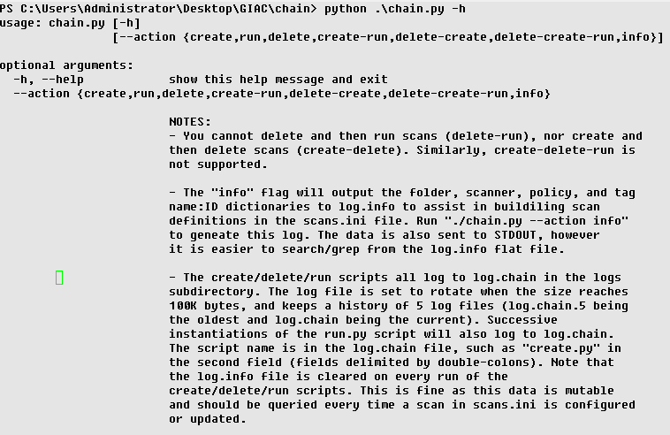
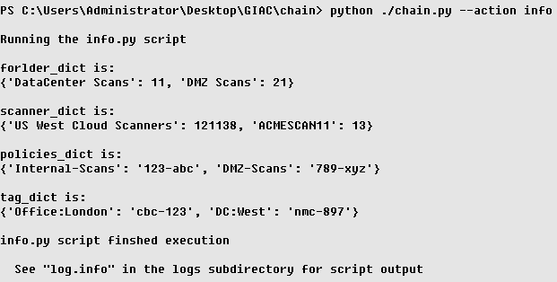
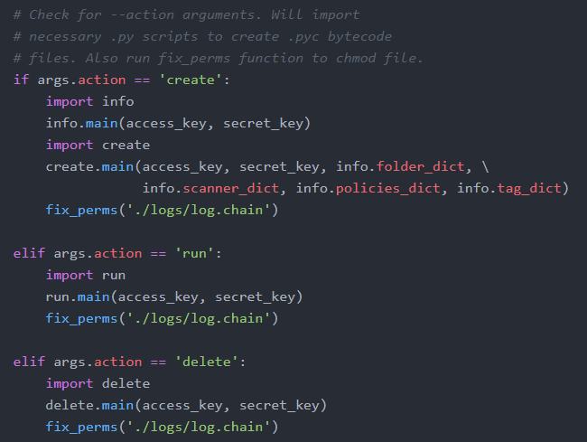
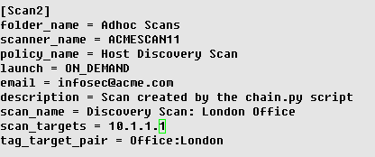
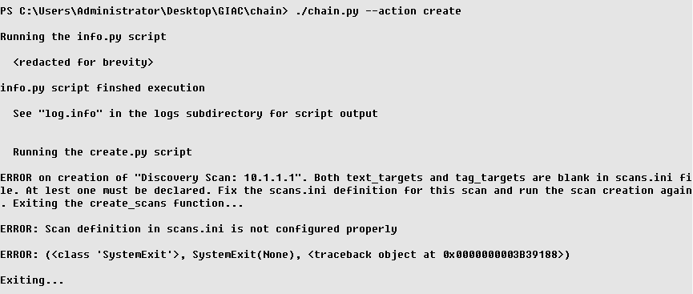
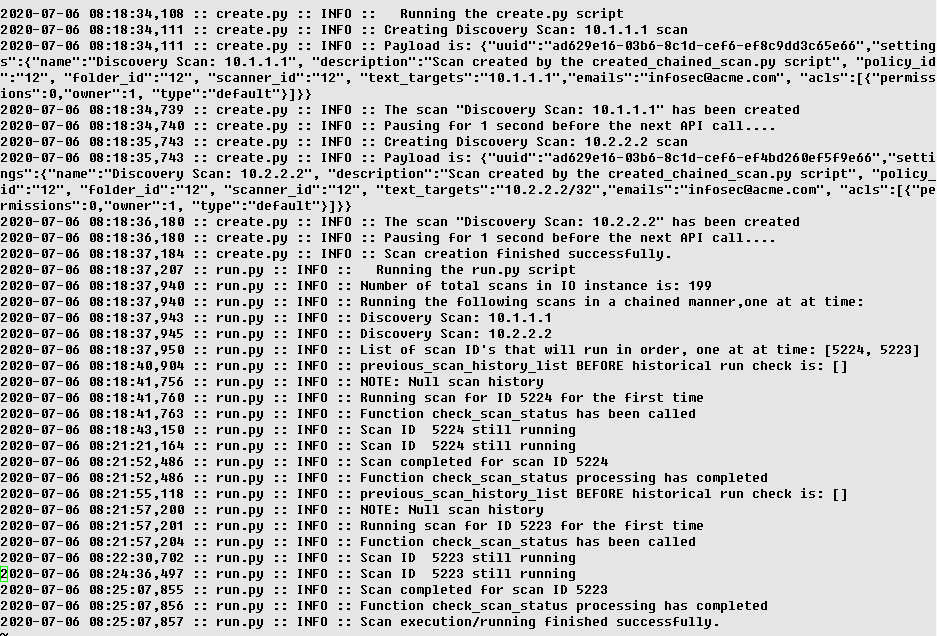
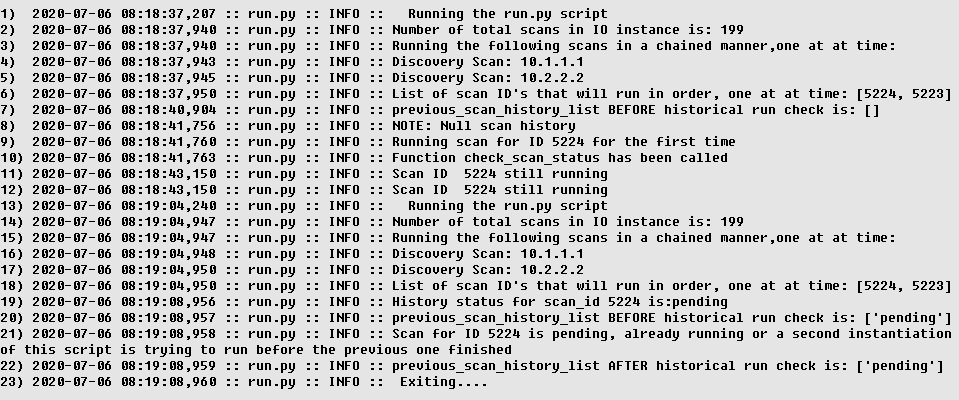

# Chaining Vulnerability Scans in Tenable IO Using Python

Author: Jeff Holland

Abstract

Enterprise vulnerability scanning traditionally makes use of multiple scanners, runs scans against targets in a parallel manner for maximum efficiency, and uses substantial amounts of bandwidth. However, a particular scanning use case exists that involves scanning targets in a sequential, or "chained", manner so as to conserve bandwidth. Tenable IO and the Tenable-supported PyTenable library do not currently support chained scanning. Using Tenable IO and a collection of Python scripts, an application by which to scan targets in a chained manner will be presented. Additional features such as the automation of scan creation, deletion and execution will be demonstrated, as well as the use of configuration files to define scans and logging parameters. The culmination of these application features will address and satisfy the use case of deploying chained scans in Tenable IO using Python and the Tenable IO REST API.

# Introduction

Vulnerability scanning, in the context of information security, is inherently at odds with itself in terms of scanning as many computing assets as possible, and in as many parallel scans as possible, while not consuming all available network bandwidth.

Ideally, vulnerability scans can be run in parallel using multiple scanners to achieve efficiency. This is especially important for densely populated network subnets where scanning windows are perhaps small due to scanning being restricted to off or maintenance hours. However, sometimes a network does not have sufficient bandwidth to accommodate parallel scans. Other times, scanning resources (e.g. scanners) are in short supply and scans cannot be distributed to multiple scanners configured in a scanner group that are able to share the scan load in parallel.

Such use cases lead to the conclusion that running dependent, or chained, scans is a potential solution. As described in his forum post, Steven Weedman inquired of the Tenable IO Forum community: "Is it possible to set up dependent scan triggers in [Tenable.IO](http://tenable.io/)? I want to chain a series of scans during off-hours. If not, is this a feature that can be requested?" (Weedman, 2020).

The answer to this question resulted in the conclusion, by several posters, that this was not possible using Tenable IO (Gillham, 2020) or PyTenable (Tenable's Python Library) (Holland, 2020). Gillham suggests using the IO API in a Python script (Gillham, 2020), and Holland elaborates on this suggested solution and offers to share a solution upon completion and employer management approval to share the code (Holland, 2020).

The solution to Steven Weedman's question is presented herein as a collection of scripts and configuration files. The original question of how to run dependent scans, referred to as "chained" scans going forward, is specifically addressed. In addition, other useful features are built into the code. One such feature includes being able to query the IO API for customer specific information needed to build the scan configuration file.

Another feature is the automation of scan creation, deletion and execution, either manually or from a cron job, via the Tenable IO API. Incorporation of the Python ArgParse module to present usage information and flag/argument validation, and the Python ConfigParser module to parse the scans definition file, are supported features as well. Finally, robust error checking for misconfigured scans in the scan definition file and use of the Python Logging module to log to both STDOUT and log flat-files, is supported.

The code presented here assumes use of Python version 3.7.4 and running said code on the Linux or Windows. Some discussion and examples assume Linux is used as the OS for the application deployment (e.g. chmod commands and cron jobs). Windows will respect os.chmod directives in the application code and will set the read-only bit, but not the other bits (docs.python.org, 2020). If running the code on Windows, configure the file and directory permissions and ownership as necessary.

# Vulnerability Scanning

## What is Vulnerability Scanning?

To avoid any ambiguity or confusion, this paper shall describe vulnerability scanning, or assessment, as: "... a process that identifies and evaluates network vulnerabilities by constantly scanning and monitoring your organization's entire attack surface for risks." (Tenable, 2020).

## What is "Chained" Vulnerability Scanning?

As posed by Steven Weedman in the context of dependent scanning by chaining a series of scans (Weedman, 2020), and rebranded as "chained scanning" (Holland, 2020), "chained" vulnerability scanning is defined as the running, or execution, of a pre-defined set of vulnerability scans, in order, in a sequential manner, where the scan n+1 runs only after scan n has completed.

## Chained Vulnerability Scanning Use Cases

As described previously, chained vulnerability scanning has several use cases. The first use case would include scanning a low bandwidth network where parallel scanning would result in an unacceptably high usage of available bandwidth. The second use case would be scanning a network where there are insufficient scanning resources for parallel scanning, such as a single scanner (Weedman, 2020). The final use case addresses scanning a network where sequential scanning is required, but scheduling scans in IO based upon prior scan times is imprecise due to changing network usage patterns, routine asset additions and deletions, etc (Holland, 2020).

While chained scanning could be applied to external public-facing assets using Tenable's cloud-hosted scanners, herein it is focused on scanning internal assets and networks. However, it's entirely possible to apply this concept to external scans, if desired, by simply using a cloud-hosted scanner or scanner group in the scans config file. One such external scanner would be, for example: "US West Cloud Scanners" (Tenable, 2020).

# Vulnerability Scanning using the Tenable IO REST API

## What is a REST API

As defined by Margaret Rouse (Rouse, 2020), "A RESTful API is an application program interface (API) that uses HTTP requests to GET, PUT, POST and DELETE data.". Tenable IO, Tenable's cloud-based vulnerability scanning product, utilizes a REST API for configuring customer-specific instances of IO. Specifically, the Tenable IO API allows a customer to create vulnerability scans, delete them, and run (or execute) them by way of API calls using API keys allocated to a user in a specific customer's IO instance. Many other actions can be taken via the API, some of which are described in the next section.

## Tenable IO API Endpoints

An API endpoint is a term used to describe a web-based service that utilizes an API (Application Program Interface) and advertises its service via a URL (RapidAPI, 2020). For example, the Tenable IO API endpoint for creating a scan is:

url = "[https://cloud.tenable.com/scans](https://cloud.tenable.com/scans)"

This particular endpoint is described in their IO API Explorer at [https://developer.tenable.com/reference#scans-create](https://developer.tenable.com/reference#scans-create) (Tenable, 2020). The IO API explorer is an invaluable reference and tool for using the API and creating automation scripts. Part of its feature set is to allow the user to enter their API keys and test the endpoint by way of the explorer actually effecting a change in their IO instance. The code used to run the API endpoint command is shown in the selected programming language, as well as the results of the API call (successful or not). What is left to the user is to write the middleware to tie the results from API endpoint calls together into a fully functioning application.

The programming language support is extensive, including but not limited to: Python, cURL, Java, Go, Ruby, and Powershell (Tenable, 2020).

The API endpoints used throughout the code include:

| **Endpoint Name** | **Endpoint URL(s)** |
| --- | --- |
| Folders | url = "https://cloud.tenable.com/folders" |
| Scanners | url = "https://cloud.tenable.com/scanners"   url = "https://cloud.tenable.com/scanners/scanner_id" |
| Policies | url = "https://cloud.tenable.com/policies" |
| Tags | url = "https://cloud.tenable.com/tags/values" |
| Scans | url = "https://cloud.tenable.com/scans"   url = "https://cloud.tenable.com/scans/scan_id"   url = "https://cloud.tenable.com/scans/scan_id/launch" |

Note that the "scanner\_id" and "scan\_id" in the URL's above are placeholders for the actual scanner ID and scan ID to be passed to the API endpoint call as a variable with the scripts.

# Chained Scanning Using chain.py

## Overview of chain.py Processing

    **Wrapper script: chain.py**

The main, or wrapper, script for the application is called chain.py. This script is the entry point for running the application to create, delete, run and/or query IO for instance information. This script will parse the command line arguments supplied, and if there is an error, report on the error and supply usage information. This is accomplished using the ArgParse module. Usage information can be obtained by using the "-h/--help" option as shown below:

 Figure 1: chain.py -h output

Chain.py performs other actions as listed below:

- Uses the dotenv library (which will likely need to be installed using pip as it's not in the Python standard library) to create environment variables for the API keys from the .env file. More discussion on this topic occurs in section 4.4.

- Creates the subdirectory "logs" in the "chain" directory where chain.py is run from if it doesn't already exist. Then it chmod's the directory 700 (read-write-execute for owner only). This directory will contain two logs files, log.chain and log.info. The log.chain log file will contain all the logs from three scripts that are imported from chain.py: create.py, delete.py, and run.py. The log is created in append mode, and rotates once it reaches 100,000 bytes and saves 5 backup copies before deleting the 6th one in a FIFO manner. The log.info file contains the IO instance specific information needed to build and modify the scan configuration file, scans.ini. See section 4.2 for instructions on building scans.ini. Because this information is mutable within the IO instance, log.info does not rotate and is clobbered every time info.py is run. Every time log data is written to one of the two logs, the chain.py script will chmod that log file 600 (read-write for owner only) as a means of programmatically ensuring the permissions stay read-write for the owner only.

- The chain.py script will call one or more of the "action" scripts, so called because of the command line flag "--action" that invokes them. These scripts are passed the IO API keys "access\_key" and "secret\_key" as arguments for use in API calls in their functions. This results in API keys never being written to disk anywhere but the .env file. See section 4.4 for a more comprehensive discussion of API keys and how chain.py secures them.

- The chain.py script, as do all the action scripts, contains logic to prevent them from being invoked directly without arguments. In other words, invoking create.py with the command "./create.py" or "python ./create.py" will result in the script exiting as shown below:

 Figure 2: Chain.py output when run without arguments

Proper syntax for running chain.py with the "info" argument is shown in Figure 3 (output redacted):

 Figure 3: chain.py --info output with redacted data

Python modules from the standard library used in chain.py include:

| **Module** | **Intended Use** |
| --- | --- |
| argparse | Enables use friendly command-line interfaces and parses them (Python.org, 2020) |
| textwrap | Among other uses, removes common leading whitespace characters from lines in a text string (Python.org, 2012) |
| os | Enables Python to utilize operation system functionality, such as chmod'ing a file to change its permissions (Python.org, 2020) |

Python libraries used in chain.py that may need to be installed include:

| **Module** | **Intended Use** |
| --- | --- |
| dotenv | Reads values from a .env file for use in creating environment variables (Pypi.org, 2020) |

    **Action scripts: run.py, create.py, delete.py, info.py**

The action scripts perform as they are named with respect to scans. Create.py creates scans in an automated fashion using the API and the scans.ini config file in its entirety. Delete.py deletes scans based on the names of the scans in scans.ini, and similarly run.py runs the scans based on scan names defined in scans.ini. The info.py script, as mentioned previously and demonstrated in Figure 3 above, queries for the customer specific IO instance information needed to build or update scans.ini. It also queries for the various ID values needed to create a scan and passes that data to create.py. This was implemented to achieve code deduplication between info.py and create.py.

Note that because the four action scripts are imported as modules in the chain.py script, bytecode versions of each are created. These bytecode versions of each script (with the .pyc extension) allow for faster subsequent execution times (Bennett, 2018). Once imported in chain.py, the main function within each action script is called and is passed the API keys as variables that were declared with the value of the environment variables from the .env file as shown below in Figure 4.

 Figure 4. Snippet of chain.py showing action scripts being imported as modules

Python modules from the standard library used in create.py, delete.py, and/or run.py include:

| **Module** | **Intended Use** |
| --- | --- |
| fileconfig | Creates class instances out of config file sections (Pypi.org, 2019) |
| configparser | Enables configuration files to be use by Python and easily updated by end users (Python.org, 2020). |
| json | Enables encoding and decoding of JSON blobs in Python (Python.org. 2020) |
| logging | Implements logging for applications that is flexible and works with configuration .ini files (Python.org, 2020) |
| re | Enables use of regular expression methods in Python similar those operations found in Perl's regular expressions (Python, 2020) |
| requests | Enables Python to easily send HTTP requests (Requests: HTTP for Humans, 2020) |
| sys | Enables Python to access interpreter variables and functions (Python.org, 2020) |
| time | Enables Python to access time-related functions (Python.org, 2020) |

Python modules from the standard library used in info.py include:

| **Module** | **Intended Use** |
| --- | --- |
| fileconfig | Creates class instances out of config file sections (Pypi.org, 2019) |
| json | Enables encoding and decoding of JSON blobs in Python (Python.org. 2020) |
| logging | Implements logging for applications that is flexible and works with configuration .ini files (Python.org, 2020) |
| requests | Enables Python to easily send HTTP requests (Requests: HTTP for Humans, 2020) |

    **Special features: "Clobber" prevention in run.py**

The run.py action script has logic to prevent "clobbering". What this means is that when run.py is executed, and is still running its first instantiation, a subsequent execution of the script will not be allowed to execute the same scans a second time. This was implemented to address the following use case:

Assume chain.py was configured to run every hour from a cron job and scan a few high value assets or modestly sized subnets (remember, chained scanning implies scanning at least two assets and/or subnets using at least two scans). Knowing when new vulnerabilities are discovered for any of these assets/subnets is key as they contain critically sensitive data. Such a discovery will be reported via a scheduled report in IO that runs a few minutes after each hour.

If the chained scans that were run at 1200 hours were still running at 1300 hours when run.py was scheduled to execute again, the script will detect a running or pending scan already in progress (via recursive polling of the scan status from the API scans endpoint) and exit. Hence, the scans scheduled to run at 1300 hours will not "clobber" the scans still running from the invocation of run.py at 1200 hours. Doing so would be counter to the very premise of chained scanning, which is running one scan at a time and waiting for it to complete before running the next scan.

Now, this feature is not without imperfections. There are small windows of time where an API call is made to execute scans defined in scans.ini, but the Tenable IO instance has not yet processed the API endpoint request (in the form of an HTTP PUT). This results in a race condition. It is an unfortunate byproduct of having a cloud-based server that utilizes a multi-tenant API (meaning multiple customers share the public API engine and are subject to queueing and rate limiting) (Tenable, 2020).

However, run.py does provide protection against clobbering a currently running chained scan with another set of scans a majority of the time. Furthermore, logging of any such clobbering prevention, or a lack of clobbering protection having taken place, is logged in the log.chain file for postmortem analysis. A demonstration of clobber protection will be presented in section 4.5.

# Building the scans.ini Config File

Scans must be defined in the scans.ini file prior to running create.py, delete.py, and/or run.py, and there must be at least two scans defined. There is guidance in the comments along with scan definition examples in scans.ini.

The fields required for each scan definition are as follows:

| Folder name |
| --- |
| Scanner, or scanner group, name |
| Scan policy name |
| Launch frequency (should always be ON\_DEMAND) as chain.py runs manually or via a cron job |
| Comma-delimited list of email addresses to send scan completion emails to (optional) |
| Scan description (optional) |
| Scan name (must be unique) |
| Comma-delimited list of scan targets (can use IP's, CIDR subnet notation, or both) \*\*\* |
| One or more tag name:value pairs, comma-delimited. If tag name is "Office" and the tag value is "London", the pair is "Office:London". For multiple tag name:value pairs, the format would be:    Office:London,Office:Berlin,Servers:Mail  There should be no spaces before/after the colons and commas, however the code will remove any that are added by mistake. Spaces in the tag name or value is allowed. For example, these tag name:value pairs are legitimate:    Office:New York,Windows Hosts:Mail Servers.\*\*\* |

\*\*\* One, or both, of scan\_targets and tag\_target\_pair must be defined. Conversely, if both are undefined, the script will exit with an error.

Figure 5 shows the format for two scans using our (redacted) instance information from log.info:

 Figure 5. Sample scans.ini config file

To run three scans, simply add a [Scan3] section and define the parameters as desired. Referring back to Figure 3, note that based on the names in the dictionaries (folder\_dict, scanner\_dict, etc), the create.py action script will use the names in Figure 5 as the key to obtain the corresponding ID/UUID value in the dictionary. Said another way, if the folder\_name for the scans in Figure 5 is "Adhoc Scans", the create.py action script will use that string to obtain the folder\_dict ID value of "35". These lookups occur programmatically inside of create.py by importing info.py and returning the dictionaries as parameters at the end of the script for create.py to use. This is reflected in Figure 4, where the create.main function is passed "info.folder\_dict" as an argument.

As noted previously, one can define both scan\_targets and tag\_target\_pair. For example, assume [Scan2] is defined to have both scan\_targets and tag\_target\_pair populated as shown below in Figure 6.

 Figure 6. Sample scans.ini config file with both scan\_targets and tag\_target\_pair defined

This config will run and scan both the 10.1.1.1 IP and the London office using the IPs/subnets defined in that tag.

If neither scan\_targets nor tag\_target\_pair is defined, running "./chain.py --action create" would result in a fatal error as shown below in Figure 7:

 Figure 7. Redacted output from chain.py when both scan\_targets and tag\_target\_pair are undefined

It is worth emphasizing that create.py supports use of tags in scan creation. If a tag name has been created called "Office", with the tag value of "London", and has an associated IPv4 rule with all the IP's and/or subnets allocated to the London office, defining each IP/subnet to "scan\_targets" in scans.ini is unnecessary. Using the tag is a "single source of truth" within IO and is much more maintainable when creating scans, reports, etc for the London office. An example of how this tag would be created in the Tenable IO UI is shown below:

 Figure 8. Tag creation in Tenable IO UI

Using tags is the preferred method of defining targets in IO scans, and is supported and encouraged when using chain.py. See [https://developer.tenable.com/docs/manage-tag-based-scans-tio](https://developer.tenable.com/docs/manage-tag-based-scans-tio) for a full discussion (Tenable, 2020).

# Logging Config File: logging.ini

Logging for the application is achieved by using the Python Logging module and a logging configuration file named logging.ini. This provides a centralized logging configuration definition and all the flexibility (and complexity) that comes with the fileConfig function.

The logging.ini file configures three handlers. The first is a StreamHandler (for printing script output to STDOUT on the console), and the second is a FileHandler for info.py to print its output to a log file in write mode. The third handler is a RotatingFileHandler and is used by the create.py, delete.py and run.py action scripts to print to log.chain using append mode. File rotation of log.chain is supported with a setting of 5 backup files each with a max of 100,000 bytes.

This results in each action script only having one logging declaration for each message that gets logged to both STDOUT and a log file. The statements take the form of one of the following, where all the logging statements have the log severity of "INFO" and logger statements that use variables make use of Python f-strings:

logger.info('\<text to log\>')

OR

logger.info(f'\<text to log {variable_name}\>')
 

See the logging.ini config file for the format. The format of the log files themselves is as follows:

\<Timestamp\> :: \<Action Script Name\> :: \<Severity Level\> :: \<Message\>

The contents of log.info is shown below in Figure 9 illustrating this format (redacted and condensed for presentation). For log.info alone, a blank line is placed between the log entries for flat-file readability when using it as a reference to build the scans.ini file.

  Figure 9. log.info file after running "./chain.py --action info"

The format of log.chain is shown below in Figure 10 (redacted for presentation):

 Figure 10. log.chain file after running "./chain.py --action create-run"

# Securing API Keys

Storing API keys (also referred to as "secrets") for scripts to run without having to provide them on the command line as an argument is fraught with risk. Let's be clear: API keys are passwords. They are typically complex and of significant length, but passwords nonetheless. There are a number of options for securing API keys, some of which have less inherent risk than others with respect to exposure of the API keys to unauthorized persons or processes. They are discussed below, as well as to why chain.py uses the option that it does.

Requiring the API keys to be read from the command line as an argument results in not having to hardcode the secrets in each script, or a single file that gets parsed by all scripts. However, this results in not being able to run them from a cron job. They must be run manually. Also, the secrets could be written to the user's .bash\_history file if supplied as a command line argument (assuming execution occurs on Linux and using the bash shell). A more complicated byproduct of running scans manually could result in logging the commands via syslog to the SIEM. Now the secrets are in the SIEM, and SIEM logs are not meant to be purged on a one-by-one basis. One option for keeping secrets out of .bash\_history and SIEM databases is to use the getpass module to query for secrets from inside the script at runtime, hence never writing them to disk (only to memory). However, the inability to cron the script execution remains.

Hardcoding API keys in scripts is the most risky and least palatable of all the options. Hardcoding is when secrets are declared in a single file that gets parsed by scripts, or in every script that utilizes them. With this option, the importing of secrets into a GitHub or other repo along with code is a significant risk that could lead to them being exposed to unauthorized persons. Also, the secrets rely upon the file permissions of the script file(s), which may not always be as restrictive as they should and need to be.

Storing secrets in a "dot file", such as .env, and then using a Python library like dotenv to create environment variables is still hardcoding secrets. However, there's some mitigating controls that makes this more palatable than hardcoding secrets in scripts. This is the option that chain.py uses.

First off, chain.py chmod's the .env file 600 (read-write for owner only). This mitigation uses file permissions to keep the file from being viewed by unauthorized users. Then chain.py chmods .env 600 every time it is invoked, regardless of what the permissions are currently set to. While this is most likely an unnecessary action after the first time the file's permissions are set, it does provide a programmatic way to change the permissions to the correct setting should a user ever change them to a more permissive state on purpose or by accident.

Secondly, if a GitHub repo is created for the code, a .gitignore file can be created and configured so the .env file does not get inserted into the repo (FreeCodeCamp, 2020). By creating environment variables and then passing those environment variables as arguments to the main function of the action scripts from chain.py, secrets are never written to disk anywhere but the .env file. For additional security, the environment variables can be "unset" (or deleted) at the end of any action script execution (Pypi.org, 2020).

The final potential option to be briefly discussed here is using a password vault, such as Hashicorp Vault (HashiCorp, 2020) or CyberArk AAM (CyberArk, 2020). This is the ideal and most secure option. However, this option requires a license for commercial use of these enterprise tools, and the configuration of them is beyond the scope of the topic being presented here.

# Using chain.py

Using chain.py, addressed previously in demonstrating other aspects of the scripts such as logging, is addressed formally and in its entirety here. There are a combination of action script command variations supported by chain.py. These include:

| **Command** | **Result** |
| --- | --- |
| ./chain.py --action info | Obtain IO instance data and write to STDOUT and log.info |
| ./chain.py --action create | Create scans defined in scans.ini and write to STDOUT and log.chain |
| ./chain.py --action delete | Delete scans defined in scans.ini and write to STDOUT and log.chain |
| ./chain.py --action run | Run scans defined in scans.ini and write to STDOUT and log.chain |
| ./chain.py --action create-run | Create and then run scans defined in scans.ini and write to STDOUT and log.chain |
| ./chain.py --action delete-create-run | Delete, create, and run scans defined in scans.ini and write to STDOUT and log.chain |
| ./chain.py --action delete-create | Delete and create scans defined in scans.ini and write to STDOUT and log.chain |
| ./chain.py -h./chain.py --help | Print usage information of chain.py to STDOUT |

Note: The following arguments to chain.py are not supported as they are either unnecessary or nonsensical: create-delete, delete-run, run-create-delete, run-delete, and run-delete-create.

As briefly discussed in section 4.1.3, chain.py works, at a high level, by parsing scans.ini to obtain all parameters needed to create scans, or just the scan names required to either run or delete scans. To run or delete scans, the run.py and delete.py action scripts (when called by chain.py) lookup the scan ID's (based on the scan names from scans.ini) and use the API scans endpoint to delete or run the scan.

The chaining functionality occurs only in run.py. The create and delete action scripts also run sequentially and one at a time, as each scan is created or deleted based upon a single API call to the scans endpoint with a single unique scan ID value. However, create.py and delete.py have no specific chaining logic in their code.

Based on scan names parsed from scans.ini and the scan ID's associated with the scan names, run.py builds a Python list of the ID's. For the first scan ID in the list, run.py launches the scan using that ID with the scans API endpoint. Then run.py calls the check\_scan\_status function to poll the status of the scan using the scan ID. If the scan status is "pending" or "running", run.py sleeps for 30 seconds in an infinite while-loop inside the check\_scan\_status function. When the scan status is marked as "completed" by the API, run.py breaks out of the while-loop, exits the check\_scan\_status function, and launches the next scan in the list based on the scan ID list's second index value.

The "clobber" protection is effected by keeping track of the scan status values for each scan in a separate list. If any status is "pending" or "running", a second instantiation of run.py is terminated. Consider Figure 11 below:

 Figure 11. Demonstration of clobber protection by running a second instantiation of run.py while the first instantiation is still executing

On lines (1) through (12) run.py was executed via the command "./chain.py --action run" based upon the log message (note the "run.py" string in each log entry). The prior history status for these two scans was, as shown on lines (8) and (9), "[]" or "Null". This means these scans had not run previously and had no history in the IO instance backend. Tenable IO keeps a scans history for as long as that scan is defined (or in other words, until it's deleted from the IO instance).

Line (13) shows the command to execute run.py was issued again from another shell (or cron job) that caused run.py to execute while the first instantiation was still running. Then run.py detected that the first scan (Discovery Scan: 10.1.1.1) with scan ID 5224 from the first invocation of run.py was still pending on line (19).

The second instantiation of run.py then checked the status of all the scans that were launched sequentially in the first run.py execution on line (20). The result was "['pending']", as scan ID 5224 was still queued to run, and scan ID 5223 was waiting to be launched when 5224 finished. Ignore the fact that scan ID 5224 was queued to run before 5223, it's not relevant that the scan ID's run in numerical order, only that they run one at time and in the order as defined in the Python list on line (6).

Line (21) indicates the second instantiation of run.py detected the scan for ID 5224 was still pending, running or a second instantiation. The first and third of those three possibilities was true, and hence the second instantiation of run.py terminated itself at that point as indicated on line (23).

# Processing Quirks in chain.py

There are some processing quirks to using chains.py to delete and create scans while updating scans.ini between executions.

Assume scans.ini is configured to create scans for 10.1.1.1 and 10.2.2.2 and place them in the "DataCenter Scans" folder with scans names reflecting their IP address (e.g. Discovery Scan: 10.1.1.1). Then "./chain.py --action create" is executed to create the scans in IO. Next scans.ini is updated to create scans 10.3.3.3 and 10.4.4.4 and place them in "DataCenter Scans" (replacing 10.1.1.1 and 10.2.2.2. in the config file with 10.3.3.3 and 10.4.4.4). Again, "./chain.py --action create" is executed to create the scans in IO. Finally, "./chain.py --action delete" is executed to delete the scans.

Which scans get deleted? Only 10.3.3.3 and 10.4.4.4, as the delete.py script reads the scan names to be deleted from the scans.ini file, looks up their scan ID in the scans\_dict dictionary, and then uses the scan API endpoint to delete them. So what's left in the "DataCenter Scans" folder are the scans for 10.1.1.1 and 10.2.2.2.

Why was chain.py implemented this way? The reasoning is that there might be scans in the "DataCenter Scans" folder that were not created by the chain.py script. Deleting all scans in the "DataCenter Scans" folder could result in some scans having to be recreated and the history of those scans being purged from the IO instance.

To prevent this quirk from occurring, delete scans before modifying scans.ini and creating scans with different names, if applicable. Worst case, if a number of scans were created after iterations of modifying scans.ini and running chain.py, go into the IO web UI and select the scans to delete and move them to the trash. Then empty the trash. This deletes the scan resource and its ID from the IO backend (which means if any of these scripts are recreated, their history will be NULL and their scan ID will almost surely change, which will be reflected in the log.chain log file).

If this quirk wasn't a concern and the application user simply wanted every scan to be deleted from a specific folder every time the delete.py script was executed, delete.py could be modified to do so. Simply obtain a list of all scans from the API scans endpoint to obtain the scan ID's. Then query the scan details for each scan based on the Scan ID from the API scans endpoint. Next, parse out the scans IDs for all scans that live in the folder "DataCenter Scans", for example, and place them in a Python list (or tuple). Each scan may then be deleted based on its scan ID from IO, one at time in a loop, using the API scans endpoint.

# Conclusion

With chain.py and its associated actions scripts (create.py, delete.py, run.py, and info.py) efficient scan creation, deletion and chained running/executing can be accomplished using Tenable IO. Having a library of scans defined in scans.ini for specific folder, scanner, and policy combinations would allow the application to automate all scan creations. Some scans could be ON\_DEMAND, such as the chained scans that would run from a scheduled (cron) job. Other scans could be scheduled to run directly from IO itself and not be chained. Just a few script modifications would be required to pass the additional parameters to the scan creation function. Remember, chain.py's modular action scripts create.py, delete.py, and run.py operate independently from each other. Creating a script using chain.py is not coupled to running or deleting chained scans.

It bears acknowledging that the Tenable-supported PyTenable library provides a framework to enable scan creation/deletion/execution automation as well, with just a little bit of middleware code written to tie various methods together. However, PyTenable does not support chained scanning and clobber prevention like chain.py does. Further, utilizing PyTenable would abstract much of the programmatic interaction with the IO API endpoints. This would be counter to gaining as much experience with Python scripting and Tenable IO API automation as possible, which is the point of this paper.

A few assumptions and required steps to configure the application are listed below, as well as in README.md in the root of the repo:

- The code was written on and for both Windows and Linux using Python 3.7.4.

- Make sure all necessary modules and libraries are installed, including the dotenv library (with all other modules required being resident in the standard Python library).

- Create and populate the .env file in the "chain" subdirectory of the cloned/forked repo with the API keys. The contents of the .env file is shown below, with stub values for the API keys there for replacement.

ACCESS\_KEY=<access\_key>

SECRET\_KEY=<secret\_key>

Replace <access\_key> and <security\_key> with your corresponding user API keys from IO. Then chmod the file 600 (chmod 600 ./.env).

- Run "./chain --action info" and use the information in log.info in the logs subdirectory to configure scans.ini. As many scans can be defined as desired, but there needs to be at least two defined.

- Run chain.py either manually or from cron, or both, as necessary.

# References

_Citefast, Citefast automatically formats citations: APA 6th edition, MLA 7th ed. and Chicago 16th ed_. (n.d.). Retrieved July 29, 2014, from [http://www.citefast.com/](http://www.citefast.com/)

Weedman, S. (2020, June 11). Tenable.IO - Dependent Scans. Tenable Community. [https://community.tenable.com/s/question/0D53a000073PwS2/tenableio-dependent-scans](https://community.tenable.com/s/question/0D53a000073PwS2/tenableio-dependent-scans)

Gillham, S. (2020, June 12). Tenable.IO - Dependent Scans. Tenable Community. [https://community.tenable.com/s/question/0D53a000073PwS2/tenableio-dependent-scans](https://community.tenable.com/s/question/0D53a000073PwS2/tenableio-dependent-scans)

Holland, J. (2020, June 13). Tenable.IO - Dependent Scans. Tenable Community. [https://community.tenable.com/s/question/0D53a000073PwS2/tenableio-dependent-scans](https://community.tenable.com/s/question/0D53a000073PwS2/tenableio-dependent-scans)

Tenable. (2020, Paragraph 1). What is Vulnerability Assessment? [https://www.tenable.com/vulnerability-assessment](https://www.tenable.com/vulnerability-assessment)

Rouse, M. (2020, April 7, Paragraph 1). What is a restful api (Rest api) and how does it work? SearchAppArchitecture. [https://searchapparchitecture.techtarget.com/definition/RESTful-API](https://searchapparchitecture.techtarget.com/definition/RESTful-API)

RapidAPI. (2020, May 11, Paragraph 2). Endpoint - What is an API endpoint? The Last Call - RapidAPI Blog. [https://rapidapi.com/blog/api-glossary/endpoint/](https://rapidapi.com/blog/api-glossary/endpoint/)

Tenable. (2020). Navigate the APIs. Tenable.io Developer Hub. [https://developer.tenable.com/reference#scans-create](https://developer.tenable.com/reference#scans-create)

Bennett, J. (2018, April 23, Paragraph 1). An introduction to Python bytecode.

Opensource.com. [https://opensource.com/article/18/4/introduction-python-bytecode](https://opensource.com/article/18/4/introduction-python-bytecode)

Tenable. (2020, Paragraph 1). Rate limiting. Tenable.io Developer Hub. [https://developer.tenable.com/docs/rate-limiting](https://developer.tenable.com/docs/rate-limiting)

FreeCodeCamp. (2020, March 31). Gitignore explained: What is Gitignore and how to add it to your repo. freeCodeCamp.org. [https://www.freecodecamp.org/news/gitignore-what-is-it-and-how-to-add-to-repo/](https://www.freecodecamp.org/news/gitignore-what-is-it-and-how-to-add-to-repo/)

HashiCorp. (2020). Manage Secrets and Protect Sensitive Data. Vault by HashiCorp. [https://www.vaultproject.io/](https://www.vaultproject.io/)

CyberArk. (2019, March 1). CyberArk secrets management | DevOps secret security. [https://www.cyberark.com/products/privileged-account-security-solution/application-access-manager/](https://www.cyberark.com/products/privileged-account-security-solution/application-access-manager/)

Tenable. (2020). Cloud scanners (Tenable.io web application scanning). Documentation Center Tenable. [https://docs.tenable.com/tenableio/webapplicationscanning/Content/Scans/CloudScanners.htm](https://docs.tenable.com/tenableio/webapplicationscanning/Content/Scans/CloudScanners.htm)

Tenable. (2020). Manage tag-based scans. Tenable.io Developer Hub. [https://developer.tenable.com/docs/manage-tag-based-scans-tio](https://developer.tenable.com/docs/manage-tag-based-scans-tio)

Python.org. (2020, June 21). Argparse - Parser for command-line options, arguments and sub-commands - Python 3.8.3 documentation. 3.8.3 Documentation. [https://docs.python.org/3/library/argparse.html](https://docs.python.org/3/library/argparse.html)

Python.org. (2012, April 9). 7.5. textwrap - Text wrapping and filling - Python v3.1.5 documentation. [https://docs.python.org/3.1/library/textwrap.html](https://docs.python.org/3.1/library/textwrap.html)

Python.org. (2020, June 21). OS - Miscellaneous operating system interfaces - Python 3.8.3 documentation. [https://docs.python.org/3/library/os.html](https://docs.python.org/3/library/os.html)

Pypi.org. (2020, April 16). Python-dotenv. [https://pypi.org/project/python-dotenv/](https://pypi.org/project/python-dotenv/)

Pypi.org. (2019, December 25). Fileconfig. [https://pypi.org/project/fileconfig/](https://pypi.org/project/fileconfig/)

Python.org. (2020, June 21). Configparser - Configuration file parser - Python 3.8.3 documentation. [https://docs.python.org/3/library/configparser.html](https://docs.python.org/3/library/configparser.html)

Python.org. (2020, June 21). JSON - JSON encoder and decoder - Python 3.8.3 documentation. [https://docs.python.org/3/library/json.html](https://docs.python.org/3/library/json.html)

Python.org. (2020, June 21). Logging - Logging facility for Python - Python 3.8.3 documentation. [https://docs.python.org/3/library/logging.html](https://docs.python.org/3/library/logging.html)

Python.org. (2020, June 21). Re - Regular expression operations - Python 3.8.3 documentation. [https://docs.python.org/3/library/re.html](https://docs.python.org/3/library/re.html)

Requests: HTTP for Humans. (2020). Requests: HTTP for Humans - Requests 2.23.0 documentation. [https://requests.readthedocs.io/en/master/](https://requests.readthedocs.io/en/master/)

Python.org. (2020, June 21). Sys - system-specific parameters and functions - Python 3.8.3 documentation. [https://docs.python.org/3/library/sys.html](https://docs.python.org/3/library/sys.html)

Python.org. (2020, May 21). Time - Time access and conversions - Python 3.8.3 documentation. [https://docs.python.org/3/library/time.html](https://docs.python.org/3/library/time.html)

OS - Miscellaneous operating system interfaces - Python 3.8.3 documentation. (2020, July 6). 3.8.3 Documentation. [https://docs.python.org/3/library/os.html](https://docs.python.org/3/library/os.html)

Python-dotenv. (2020, July 3). PyPI. [https://pypi.org/project/python-dotenv/](https://pypi.org/project/python-dotenv/)
